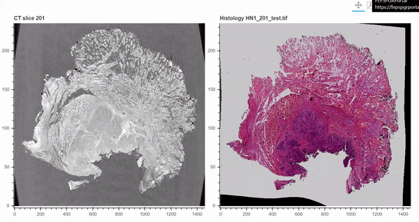

# CorView

CorView (CORrelative microscopy VIEWer) is an interactive visualisation tool for 2D-3D image datasets, where 2D images are registered to 3D stacks. Correlative microscopy datasets can be viewed side-by-side and these visualisations shared as html files. CorView contains tools to create these interactive visualisations easily.



This work was completed with support from the Engineering and Physical Sciences Research Council (EPSRC), Institute for Life Sciences, University of Southampton during a doctoral research studentship from the Faculty of Engineering and Physical Sciences, University of Southampton.

## Installation

If you are comfortable with Git, navigate to a directory of your choice in cmd and clone the repository:

```
git clone https://github.com/elainehoml/CorView.git
```

Alternatively, the repository can be downloaded as a .zip file from https://github.com/elainehoml/CorView.

## Using CorView

### Step 1: Install Anaconda to run Jupyter Notebooks

You will need to be able to run Jupyter Notebooks, see [this link for help on installing this](https://jupyter.readthedocs.io/en/latest/install.html#install). Jupyter notebooks are a convenient way to share and run code.

### Step 2: Activate Python virtual environment and launch Jupyter Notebook

Python virtual environments are used to install specific versions of Python packages without affecting your root installation.

First, open the Anaconda Prompt terminal and navigate to the directory where CorView is stored.

```
cd <CorView repo, replace with the correct directory>
conda env create -n CorView -f environment.yml
conda activate CorView
jupyter notebook
```

### Step 3: Run CorView.ipynb

CorView.ipynb is a Jupyter notebook that allows easy generation of visualisations for correlative microscopy datasets. Run each code cell and follow the steps to create your own visualisations.

## Step 4: Share your visualisations

CorView exports interactive visualisations to html, which can be opened in any web browser, no installation required! This makes it easy and straightforward to share your visualisations with others.
